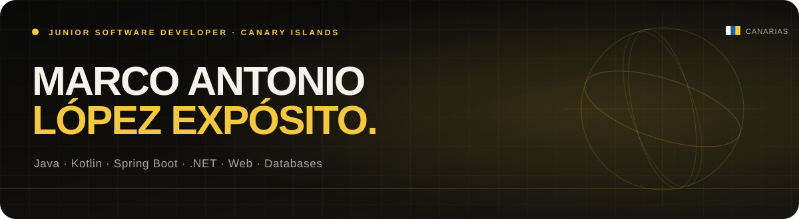
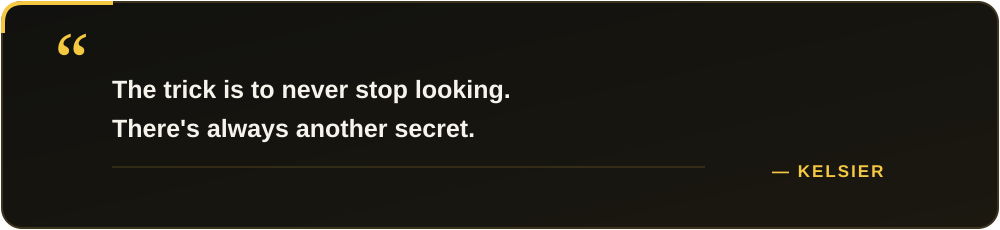

<p align="center">
  
</p>

<p align="center">
  <a href="https://www.linkedin.com/in/marco-antonio-l%C3%B3pez-exp%C3%B3sito-407b3b263/">
    
  </a>
  <a href="https://github.com/Marco1080">
    
  </a>
  
</p>

## `> about_me`

I'm a junior software developer focused on **multiplatform applications**, **web services**, and the **design and optimization of databases**.

I combine strong business logic with hands-on client experience across the creation, improvement, and maintenance of software projects. Currently working at **Programa-T** and based in **Santa Cruz de La Palma, Canary Islands**.

```java
public class Marco {
    String focus = "Useful software with clean, maintainable logic";
    String[] interests = {"Backend", "Multiplatform", "Web", "Databases"};
    boolean alwaysLearning = true;
}
```

## `> core_stack`

<p>
  
  
  
  
</p>

### Web & data

<p>
  
  
  
  
  
  
  
</p>

### Also worked with

<p>
  
  
  
  
</p>

## `> github_activity`

<p align="center">
  
  
</p>

<p align="center">
  
</p>

## `> a_line_i_keep`

<p align="center">
  
</p>

<p align="center">
  <sub>Built with curiosity, maintained with intention.</sub>
</p>
